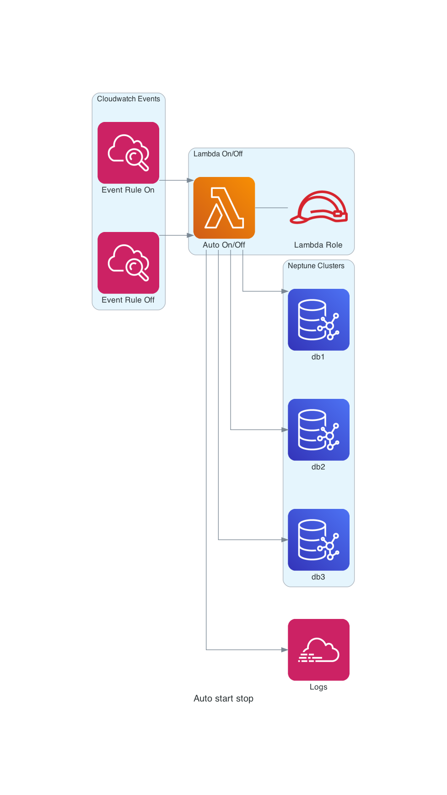

# Lambda Neptune Cluster Automatic Start and Stop 

This is a serverless application to save approximately 70% of the cost of Neptune clusters by shutting the clusters down during set hours where it is predicted that the clusters will be idle.

------

**Caution**: this application issues a boto3 client `stop_db_cluster()` command without checking with any other applications using the databases. This application should not be used in production environments without modification.

------

## Overview

This serverless application uses a scheduled lambda function triggered by AWS Cloudwatch Rule Events to stop and to start the Neptune clusters at preset times.

The application will use the following automation flow:

- A CloudWatch Scheduled Event called `neptune_on_duty` is triggered at preset time such as the beginning of the work day.
- A Lambda function scans for Neptune clusters with a tag that has a key and value of `OfficeHours=Yes` and starts the Neptune cluster(s).
- A CloudWatch Scheduled Event called `neptune_off_duty` is triggered at a preset time such as the end of the work day.
- The same Lambda function scans for Neptune clusters with a tag that has a key and value of `OfficeHours=Yes` and stops the Neptune cluster(s).




## Installation

Installation of this application is performed using Terraform.

Change the `region`, `on_duty_schedule_expression`, `off_duty_schedule_expression` values in `variable.tf` or override the values using a `tfvars` file. 

By default, this application will deploy the value for region is set to deploy into the `us-east-1` region.

For the values for the `on_duty_schedule_expression` and `off_duty_schedule_expression` values please refere to the cron expression documentation. https://docs.aws.amazon.com/AmazonCloudWatch/latest/events/ScheduledEvents.html#CronExpressions

### Installation steps

```bash
terraform init

terraform validate

terraform plan -out=tfplan

terrform apply tfplan
```

